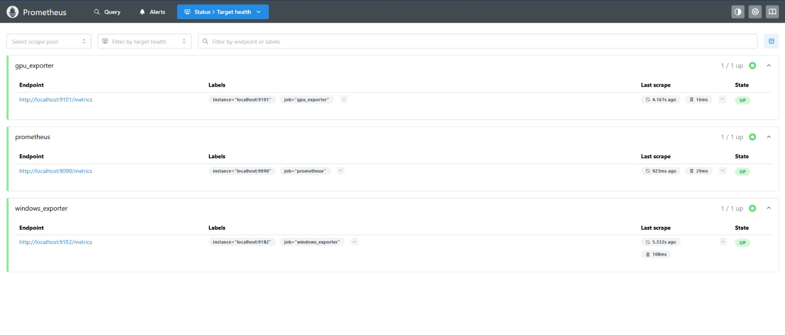

# ChromaMatch
ChromaMatch is an AI-powered color and tone analysis system that identifies skin tones, undertones, and personalized fashion recommendations from selfies. The system integrates MLOps components: MLflow for model tracking, Evidently for drift monitoring, Prometheus & Grafana for metrics visualization — all deployed on AWS EC2 with data stored in S3.


## Quickstart
```bash
git clone https://github.com/<your>/ChromaMatch.git
cd ChromaMatch
python -m venv venv
source venv/bin/activate
pip install -r requirements.txt
make dev

# Make targets
make dev - run dev server
make test - run tests
make docker - build docker
```
### Architecture
Here is the architecture diagram for the Chromamatch project.


### MLflow Model Registry

The ChromaMatch v1 model is tracked and versioned using MLflow.

- **Experiment name:** ChromaMatch
- **Model name:** ChromaMatch_Model
- **Version:** v1
- **MLflow UI:**

Here is the MLFlow screenshot to show the experiment for v1 model

### Evidently Data Drift Report
Here is the data drift dashboard created on Evidently using dummy data


### Prometheus Metrics tracking

Prometheus was set up to monitor key metrics including CPU usage, memory consumption, disk I/O, and simulated GPU utilization

Here is the snapshot to show the metric tracking



### Grafana Monitoring Dashboard
Grafana is set up to visualize real-time system metrics (CPU, memory, disk, etc.) collected by Prometheus through the Windows Exporter.

- **Data Source:** Prometheus (`http://localhost:9090`)
- **Dashboard:** Official Windows Exporter Dashboard (ID: 14694)
- **Access URL:** [http://localhost:3000](http://localhost:3000)

Here is the screenshot of the Grafana dashboard displaying live system metrics.


### Pre-commit Hooks Setup
To maintain clean, consistent, and secure code, pre-commit hooks were configured and verified.

**Active hooks:**
- `trailing-whitespace`
- `end-of-file-fixer`
- `detect-secrets`
- `black`
- `ruff`

All hooks pass successfully when running:
```bash
pre-commit run --all-files
```

## API Documentation

The **ChromaMatch API** is built using **FastAPI**, which automatically generates interactive documentation for developers to explore and test endpoints.

### Access the Auto-Generated Docs

- **Swagger UI:** [http://127.0.0.1:8000/docs](http://127.0.0.1:8000/docs)
  → Interactive interface for sending requests and viewing responses.
- **ReDoc:** [http://127.0.0.1:8000/redoc](http://127.0.0.1:8000/redoc)
  → Clean, reference-style API documentation view.

---

### Health Check
**Endpoint:** `GET /health`
**Description:** Confirms that the API is running and reachable.

**Example Response:**
```json
{
  "status": "ok"
}
```
### Analyze Image

**Endpoint:** `POST /analyze`
**Description:** Upload an image to receive AI-generated insights such as skin tone, undertone, and personalized style recommendations.

**Example Response:**

```bash
curl.exe -X POST "http://127.0.0.1:8000/analyze"
     -F "file=@C:\Users\dell\Downloads\MLOPS\ChromaMatch\monitoring\test_images\person1.jpg" `
     -H "accept: application/json"
```

```json
{
  "skin_tone": "warm",
  "undertone": "neutral",
  "face_shape": "oval",
  "recommendation": "Gold jewelry and earth tones suit you best."
}
```
Example:


## FAQ

### Q1. MLflow or Evidently dashboard not opening?

Make sure ports 5000 (MLflow) and 7000 (Evidently) are open in your EC2 Security Group.

### Q2. “Address already in use” error when running MLflow or FastAPI?

Run:
```bash
sudo lsof -i :5000
sudo kill -9 <PID>
```

### Q3. Docker build fails with “No space left on device”?

This happens in GitHub Actions free runners. Add this before installing dependencies in your workflow

```bash
sudo rm -rf /usr/share/dotnet /opt/ghc /usr/local/lib/android
```

### Q4. “ModuleNotFoundError: No module named src”
Always run commands from the project root (same directory as src/).

### Q5. How do I access dashboards on AWS EC2?
MLflow: ttp://16.16.68.249/:5000

Evidently: http://16.16.68.249/:7000/evidently

Grafana: http://16.16.68.249/:3000

Prometheus: http://16.16.68.249/:9090

## ☁️ Cloud Deployment

### Overview
ChromaMatch is deployed on **AWS Cloud** to ensure scalability, availability, and smooth MLOps integration.
The key services used are **EC2**, **S3**, **Prometheus**, **Grafana**, and **MLflow** — each serving a specific part of the end-to-end machine learning workflow.

---

### 🧩 Services Used

| Service | Purpose | Reason for Use |
|----------|----------|----------------|
| **Amazon EC2** | Hosts the FastAPI inference server, MLflow tracking server, and monitoring tools (Evidently, Prometheus, Grafana). | Provides on-demand compute with full control over the environment. |
| **Amazon S3** | Stores datasets, trained model artifacts, and logs used by MLflow for model versioning. | Durable and cost-effective object storage, ideal for ML workflows. |
| **MLflow** | Tracks experiments, logs metrics, and registers trained models. | Enables model versioning and reproducible ML experimentation. |
| **Evidently AI** | Monitors data and model drift on live inference data. | Ensures the deployed model remains accurate over time. |
| **Prometheus + Grafana** | Collects and visualizes infrastructure metrics (CPU, memory, disk I/O). | Provides real-time system monitoring and alerting for deployed services. |

---

### ⚙️ How to Reproduce the Setup

1. **Launch an EC2 Instance**
   ```bash
   # Ubuntu 22.04 t2.medium
   ssh -i chromamatch-key.pem ubuntu@16.16.68.249
    ```

2. **Clone the Repository**
    ```bash
    git clone https://github.com/noori-shaukat/ChromaMatch.git
    cd ChromaMatch
    ```

3. **Set up Virtual Environment**
    ```bash
    python3 -m venv venv
    source venv/bin/activate
    pip install -r requirements.txt
    ```

4. **Run MLflow Server**
    ```bash
    mlflow server --host 0.0.0.0 --port 5000 \
    --backend-store-uri sqlite:///mlflow.db \
    --default-artifact-root s3://chromamatch-artifacts/
    ```
5. **Deploy Fast-API App**
    ```bash
    uvicorn src.api.main:app --host 0.0.0.0 --port 8000
    ```

6. **Set up Monitoring**
- *Evidently:* Run the Evidently app to monitor data drift and generate live dashboards.
- *Prometheus:* Start the Prometheus metrics server at `http://16.16.68.249/:9090`.
- *Grafana:* Open the Grafana dashboard at `http://16.16.68.249/:3000` to visualize real-time system metrics.

### Bonus

Enabled Git-LFS for large dataset or model-artifacts
Added docker-compose.yml file
